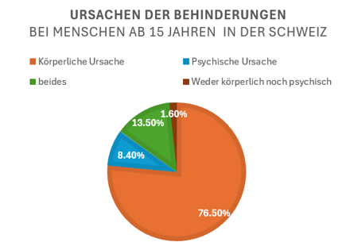

+++
title = "Barrierefrei durch die Stadt?  "
date = "2024-04-27"
draft = false
pinned = false
image = "screenshot-2024-04-27-092401.png"
+++
Das Reisen auf zwei Rädern in der Stadt Bern: Wie viel hat sich seit dem Behindertengleichstellungsgesetz im öffentlichen Verkehr der Schweiz verändert und wie stehen Menschen mit Beeinträchtigung dazu?  

Von Amélie Salacrist und Mascha Aregger 

Am RBS-Bahnhof sieht man viele orange Züge und Leute, die ein und aussteigen. Sich beeilende Leute sind leicht zu finden. Es ist Stosszeit am Bahnhof Bern. Personen begeben sich zur Treppe, um danach zu ihrem Anschluss zu gelangen. Doch für Phillipp stellt dies eine unüberwindbare Barriere dar. Die Treppe, die in vieler unserer Köpfe als Teil einer Routine angesehen wird, ist für ihn nicht brauchbar. Denn er ist auf einen Rollstuhl angewiesen. Der Nah- und Fernverkehr in der Schweiz gilt als zuverlässig, sauber und gut vernetzt. Doch für einige Menschen ist das nebensächlich, wenn sie sich in diesem Verkehr nicht barrierefrei bewegen können. Seit einiger Zeit arbeitet man in der Schweiz daran, die Benachteiligungen für Menschen mit Beeinträchtigung zu verringern und die Transportmittel universal zugänglich zu machen. Dafür trat ein Gesetz Bundesweit in Kraft, welche neuen Forderungen für die ÖV-Infrastruktur in den Mittelpunkt gebracht hat.

 

Das Gesetz trat im Januar 2004 in Kraft und steht für eine Gleichsetzung von Menschen, die mit einer Behinderung leben.

Das Ziel des Gesetzes, ist es die Benachteiligung beeinträchtigter Menschen zu minimieren. So sollten Menschen mit einer Behinderung besser in die Gesellschaft integriert werden.  

Um das zu erreichen, fordert das Behindertengleichstellungsgesetz Massnahmen zur Beseitigung der Benachteiligungen dieser Personen. Ein zentraler Punkt ist die gerechte Gestaltung des Öffentlichen Verkehrs. In einer Verordnung sind die Zahlen und Masse festgehalten, nach denen sich der ÖV richten muss. Grundsätzlich hat das Gesetz an allen öffentlich zugänglichen Orten Wirkungskraft. Ausserdem bei Wohngebäuden mit über 8 Wohnungen und bei Gebäuden, die mehr als 50 Arbeitende unterbringen. Auch im Bereich der Dienstleistung, Ausbildung wie auch Weiterbildung und bei den Arbeitsverhältnissen muss eine Gleichstellung von Menschen mit einer Beeinträchtigung vorhanden sein.

 

 

Dem Behindertengleichstellungsgesetz nach (Art. 2) ist ein Mensch mit Behinderung eine Person, der es durch eine voraussichtlich dauernde körperliche, geistige oder psychische Beeinträchtigung erschwert oder unmöglich ist, alltägliche Verrichtungen vorzunehmen, soziale Kontakte zu pflegen, sich fortzubewegen, sich aus- und weiterzubilden oder eine Erwerbstätigkeit auszuüben. Schätzungsweise 1.8 Millionen Menschen mit irgendeiner Form von Beeinträchtigung leben in der Schweiz, dabei gelten 29% als stark beeinträchtigt. Eine Körperbehinderung umschreibt unterschiedliche Arten der Körperlichen Einschränkung, die durch innerliche und äusserliche Schädigungen entstehen und die Funktionen des Körpers beeinträchtigen.

 

Bei einem Ausschluss einer bestimmten Personengruppe, spricht man von Diskriminierung. Doch Philippe, der selbst von dieser Benachteiligung betroffen ist, tue sich schwer zu sagen, dass die Barrieren im öffentlichen Verkehr für ihn eine krasse Form von Diskriminierung seien. Fakt ist, dass es sich um Diskriminierung handelt, wenn Menschen mit Behinderung den ÖV nicht autonom nutzen können. Seit dem 1. Januar. 2004 ist das Das Behindertengleichstellungsgesetz rechtsgültig. Mit dessen in Kraftsetzung müssen alle Transportunternehmen, damit auch die SBB, das autonome Reisen für Menschen mit Einschränkung ermöglichen. Autonom beschreibt in diesem Sinne die Nutzbarkeit der Verkehrsmittel, ohne Hilfe Dritter. Doch in vielen Bereichen der öffentlichen Verkehrsmittel sind Personen, die mit einer Behinderung leben müssen auf Hilfe angewiesen. Laut einer Befragung einer Sozial- Integrationspädagogin, Sarah Sallagar, aus dem Jahr 2020, stelle sich heraus, dass es eine Herausforderung ist, akzeptieren zu müssen, dass man auf andere Personen angewiesen ist.

1989 kam Philippe per Kaiserschnitt 3 Monate zu früh auf die Welt. Durch diese Frühgeburt sei es zu einer Hirnblutung gekommen. Diese Blutung hinterliess bleibende Schäden in Philippes Hirnareal, doch bedeutete nicht das Ende. Deswegen lebt er seit seiner Geburt mit einer Celebralparese, kurz “CP”. Bei ihm sind die Folgen Gleichgewichtsprobleme, sowie eine schwach ausgebildete Rumpfstabilität und eine verlangsamte Motorik. Aus diesem Grund sitzt er in einem Rollstuhl. Laut dem Universitätsspital Zürich, sind in der Schweiz rund 3'000 Kinder und 12'000 Erwachsene von CP betroffen. Die Behinderung kann sehr unterschiedlich ausfallen, je nachdem welche Hirnregionen verletzt wurden, hat es eine andere Auswirkung.

#### Umbau in der Hauptstadt

Nun ist einer der wohl wichtigsten Knotenpunkte der Schweiz im Umbau. Der Bahnhof Bern ist momentan ein Schauplatz, von Baustellengeräuschen, Bauarbeiten und einem Riesengedrängel. So ist es zurzeit auf den Gleisen und Gängen des Hauptbahnhofes. «Aktuell ist Bern einer der schlimmsten Bahnhöfe, die wir haben.» Das berichtet Werner Jordan, der Leiter von Handicap bei der SBB, im Interview. Die chronische Kurve, in der der Bahnhof liegt, ist in Bezug auf die Barrierefreiheit ein Hauptknackpunkt, der nach dem Umbau immer noch vorhanden sein wird. Die Züge und die Bahnstation selbst werden die Normen erfüllen. Dabei gibt es aber ein Problem, die Züge seien für sich und der Bahnhof sei für sich. In Kombination gäbe es immer noch Lücken, wie Herr Jordan anfügt. Genau diese Lücken, die durch die Kurve endstehen und machen das Reisen für Kunden mit Einschränkung unzugänglich.

Bei der Welle 7 sieht die Situation anders aus. Dort muss Philippe nicht die steilen Rampen nehmen. Die SBB selbst, möchte die Kundenfrequenz in Richtung Welle verlagern, denn dort sei ein geradliniges Schienennetz wie Herr Jordan hinzufügt. Um aber überhaupt dorthin zu gelangen, muss man eine steile Rampe nehmen. Philippe, der Tischtennis und Powerchairhockey spielt, könnte mit einem Handrollstuhl, so wie viele andere, die 12% Steigung, die sie hat, nicht überwinden. Insgesamt hat sich seit dem 1. Januar 2004 schon viel getan. Laut Anna Riva, der Product Managerin von Handicap, sei dieses Datum eine Spalte zwischen einer alten und einer neuen Welt gewesen. Mit dem Behindertengleichstellungsgesetz sei ein anderes Bewusstsein entstanden. Eine Zeitreise offenbart neue Erkenntnisse: begibt man sich 15/16 Jahre in die Vergangenheit, so merkt man einen grossen Unterschied. «Kunden haben sogar, als ich angefangen habe, im Gepäckwagen gereist.» Dies berichtet Anna Riva mit Emotion. Heute ist dies gar nicht mehr denkbar.

Doch ist es so getan? Philippe ist der Meinung, dass die Schweiz in diesem Zusammenhang weiter sein könnte. Erst als der Endrüstungssturm gross war, sei aus seiner Sicht die Erklärung gekommen, wieso so ein immenser Rückstand zu finden ist. Man spürt die Enttäuschung, als er die Aussage tätigt. Laut ihm solle es in der Schweiz nicht an Geld für Umbauarbeiten fehlen. Finanzielle Probleme als Begründung der Transportunternehmen klingen für ihn wie lahme Ausreden. Heute, im Jahre 2024, sollten die Forderungen des Gesetzes für die Gleichstellung beeinträchtigter Menschen erfüllt sein, doch dies ist leider nicht die Realität. An Zusammenarbeit mit den Behindertenverbänden fehle es auch. Es könne nicht sein, dass die SBB neue Züge bestelle und dann, wenn die Züge schon auf den Schienen sind, Klagen von Behindertenverbänden kommen. Philippe erzählt, dass es bei den letzten Zügen so gewesen sei. Dann frage er sich, mit wem die Verantwortlichen, die letzten Jahre denn gesprochen haben. Die Behindertenverbände müssten auch signalisieren, dass sie bereit seien, allgemein zu sprechen. Mit dem Zweck, dass nicht ein Verband, z.B. einer für Sehbehinderte, seine Interessen durchdrückt, sondern dass man zusammen an einem Strang zieht. Denn es gäbe auch viele Leute mit Mehrfachbehinderungen, die nicht nur eine Gehbehinderung haben. Er fügt an: «Also da muss ja irgendetwas komplett schief gegangen sein.»

#### Augenöffnender Rundgang

Um bei der Haltestelle Bern Hauptbahnhof den Bus Nummer 12 in der Richtung Zentrum Paul Klee zu nehmen, muss Philipp Kommunizieren. Die meisten Menschen nehmen den Bus ohne jeglichen Austausch. Philippe macht beim Busfahrer auf sich aufmerksam. Der Chauffeur steigt aus und klappt, mit einem Haken, die Rampe für Philippe auf. Nun kann er einsteigen. Er selbst findet, dass die Mittarbeiter von Bernmobil offen und nett auf ihn reagieren. Sie nehmen sich Zeit. Doch nicht jeder Fahrer ist so verständnisvoll. Bei der Station Zytglogge will er das Tram nehmen. Der Tramfahrer steigt schon leicht genervt aus und er teilt mit, dass er in Zeitdruck sei. Sicher dauert der Einstieg mit einem Rollstuhl länger, doch er hat das Recht, wie jeder andere, vom ÖV Gebrauch zu machen. Solche Unannehmlichkeiten machen das Reisen unangenehm. Bis zu diesem Zeitpunkt konnte Philippe in der Stadt Bern noch nirgends selbstständig ein oder aussteigen. Beim Bärenplatz will er das Tram nehmen.

Ein altes Tram fährt ein, doch dies ist für ihn unbetretbar, da es einen Treppeneinstieg hat. Eine Frau an der Haltestelle meint, dass diese auch für ihre Mutter ein Problem darstelle. Philippe übermittelt im Interview, dass man vermehrt darauf hinweisen müsse, dass der Umbau zur Barrierefreiheit nicht nur ihm helfen würde. Es sei nicht nur für Menschen mit einer Behinderung eine Erleichterung, wenn es Barrierefreier werde, sondern auch für ältere Menschen, Familien und Menschen mit Kinderwagen. «Das ist für alle ein sehr großer Mehrwert.» Es fährt ein Tram ein und siehe da: Phillipp kann mit seinem Elektro-Rollstuhl eigenständig einsteigen. Doch nur eine Station weiter, beim Hauptbahnhof, ist das Aussteigen ohne Rampe wieder nicht mehr möglich.

Abschliessend sagt Philippe, dass er aber auch sehe, dass es Leute gäbe, die sich wirklich Mühe geben, um etwas zu verändern. Es sei aber noch lange nicht alles getan. Zusätzlich zu Bern, gibt es noch ca. 270 weitere Bahnhöfe von 746, die von Menschen mit Einschränkung nicht ohne Unterstützung, nutzbar sind. An denen wird gearbeitet. Verbesserungspotenzial gebe es, wie Anna Riva hinzufügt, beim Angebot für Geistig Behinderte oder Personen mit einer Hörbehinderung. Diese hätten sie zwar berücksichtigt, aber sich nicht so viel mit ihnen beschäftigt, wie mit den Rollstuhlfahrern. Denn diese wären laut ihr mehr auf ihre direkte Hilfe angewiesen. Philippe findet, dass der Bahnhof nichtsdestotrotz ziemlich gut erschlossen sei. Doch ein Problem stellen für ihn die Barrieren in den Köpfen der Menschen dar, weil Personen wie ihm nicht genug Fragen gestellt werden, um herauszufinden, welche Bedürfnisse sie haben.

Im Februar 2023 wurde die «Inklusions-Initiative - für die Selbstbestimmung von Menschen mit Behinderungen» lanciert. Bis im Oktober 2024 werden Unterschriften gesammelt, um die tatsächliche Gleichstellung von Menschen mit Behinderungen voranzubringen.